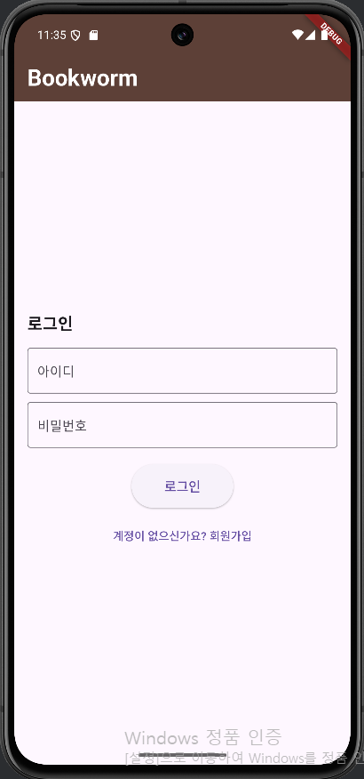
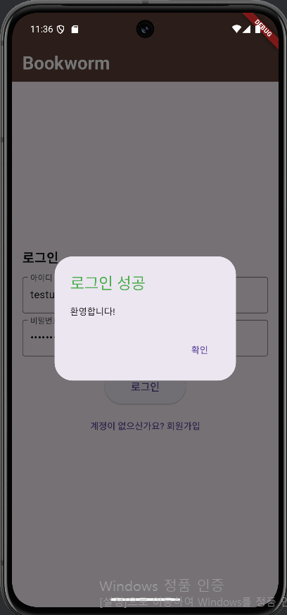
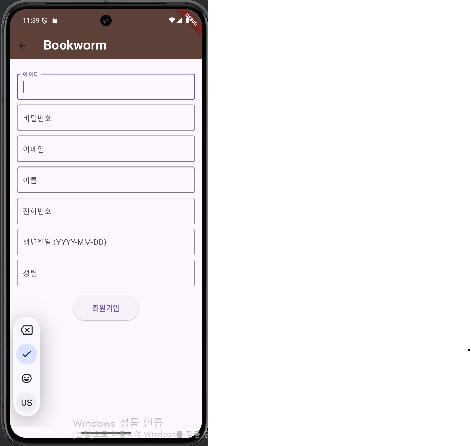
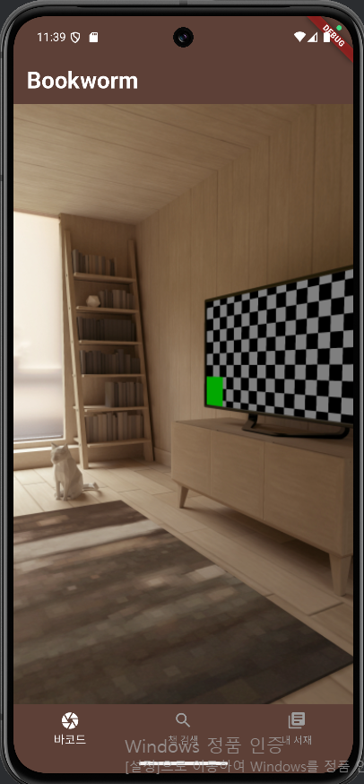
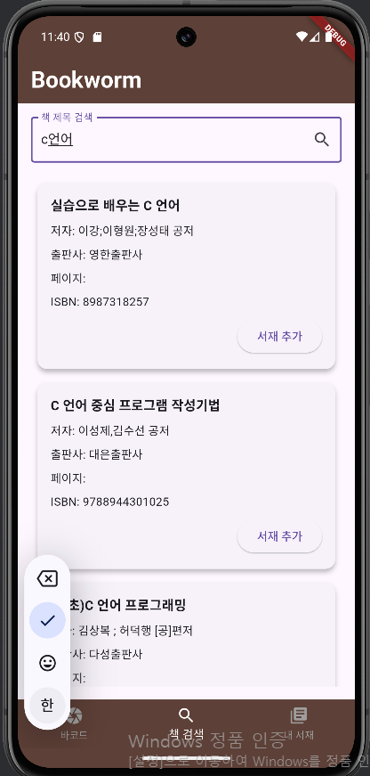
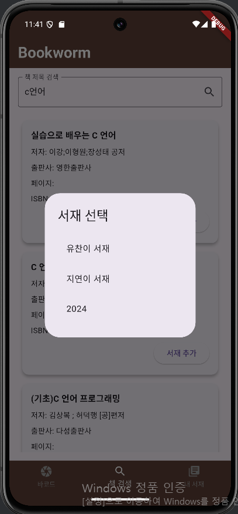
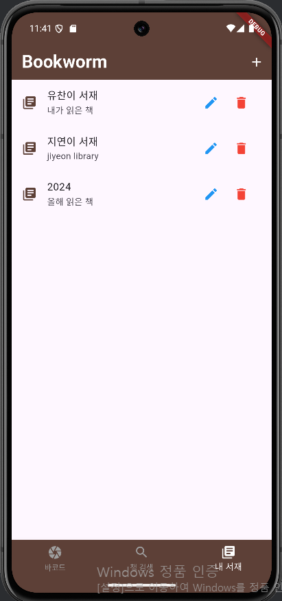
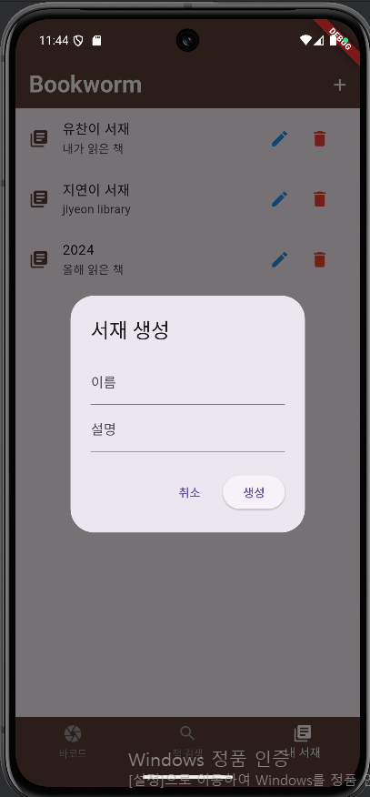
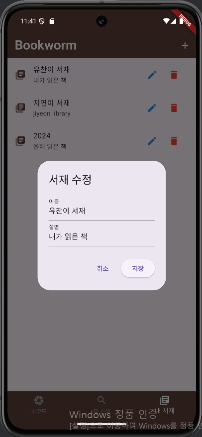
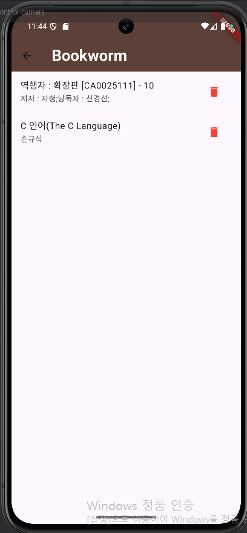

# BookWorm

### 주의 : 로컬에서 실행 시 flutter lib 내의 192.168.0.33 ip를 자신의 ip에 맞게 수정해야함.

### 1. 주제 소개
- 내가 읽었던 책들을 모아둘 수 있는 앱을 만들고 싶었습니다
- 로그인 후 자유로이 서재를 생성 삭제 수정 조회등 관리하고 원하는 책을 자유롭게 담을 수 있습니다.

### 2. 주요 기능
- jwt토큰 기반의 회원가입, 로그인 기능을 만들었습니다
- 국립중앙도서관 서지정보 API를 가져와서 제목으로 검색한 결과를 가져오고 해당 책을 내가 만든 서재에 담을 수 있게 했습니다
- 동일한 API로 앱에서 책의 바코드 촬영을 통해 ISBN 값을 검색한 결과를 가져오고 해당 책을 내가 만든 서재에 담을 수 있게 했습니다
- 유저만의 서재를 CRUD 할수 있고 서재에 책을 추가 및 삭제 가능합니다
- DB(SQLITE)에 유저의 정보와 서재, 책 정보등을 저장했습니다

### 3. 사용 
- FrontEnd : flutter 버전
- BackEnd : flask 버전
- Database : sqlite3
- Emulator : Android Studio Emulator Pixel 6
- 활용 API : 국립중앙도서관 ISBN 서지정보 API
- 버전 관리 : Github

### 4. 화면 설명

* 최초 로그인 화면  
  </img> 
  - 상단의 앱 브랜딩 로고 표시 배경색 갈색을 표시함. 앱의 모든 화면에서 공유 
  - 회원가입 된 사용자 정보인지 DB와 조회해서 로그인 가능. 신규 사용자는 하단의 회원가입 버튼 통해 회원가입 페이지로 이동가능.
 

* 로그인 성공 화면  
  </img> 
  - 로그인 성공 시 팝업화면 띄움, 실패 시 팝업 후 다시 로그인 화면
  - 확인 클릭하면 바코드를 촬영하는 메인 화면으로 넘어감
 

* 회원가입 화면  
  </img> 
  - 아이디와 전화번호와 이메일은 중복 확인 함
  - 생년월일 클릭 시 달력이 뜨면서 유저 친화적인 ui 표시
  - 값 입력 후 회원가입 버튼 눌러서 성공 시 로그인 화면으로 넘어감
 

* 책 바코드 촬영 화면  
  </img> 
  - 하단의 네이게이션 바가 있음. 상단과 마찬가지로 배경색 갈색. 활성화된 기능은 흰색 아닌 것은 회색. 모든 메인 화면에서 공유함
  - 촬영 화면에 바코드가 걸릴 경우 바코드의 ISBN정보로 도서 정보 검색
 

* 책 제목 검색 화면  
  </img> 
  - 책 제목 검색 시 국립중앙도서관 서지정보 api 통해 검색한 결과를 가져와서 표시 (제목, 저자, 출판사, isbn, 페이지, 책 표지 이미지)
 

* 서재 선택 화면  
  </img> 
  - 내가 생성해둔 서재들이 표시됨. 클릭시 해당 서재에 책이 추가됨
 

* 내 서재 화면  
  </img> 
  - 내가 생성해둔 서재들이 표시됨. 이 화면에서 CRUD 가능
  - 빨간색 삭제버튼 누르면 삭제됨

* 서재 생성 화면  
  </img> 
  - 내 서재 화면에서 + 누르면, 생성하고 싶은 서재의 이름과 설명을 입력해서 생성함
 

* 서재 수정 화면  
  </img> 
  - 내 서재 화면에서 파란색 펜 누르면, 해당 서재의 이름과 설명 수정가능
 

* 서재 내 책 확인 화면  
  </img> 
  - 내 서재 화면에서 서재를 누르면, 해당 서재 내의 책들을 표시
  
